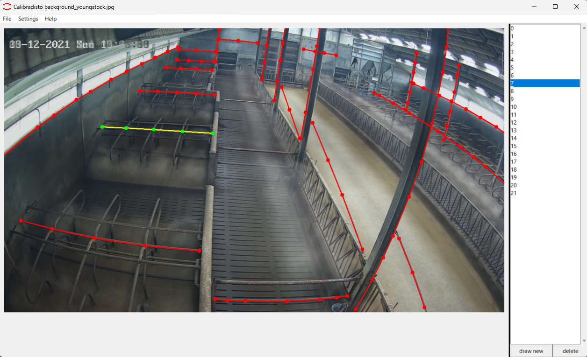

# Calibradisto
Calibradisto

CALIBRAtion of DISTOrtion

Calibradisto is software to annotate real world straight lines in images, which appear to be curved in images due to radial lens distortion. Using these annotations, the parameters of a radial distortion model can be determined. Based on such a radial distortion model, images can be undistorted.

For every annotated image, a .json file is created which contains for every annotated real world straight line the image coordinates of constituting vertices.

Calibradisto can be run from the calibradisto.py file, but can also be compiled to an executable file using pyinstaller in combination with the compilation parameters specified in calibradisto.spec

